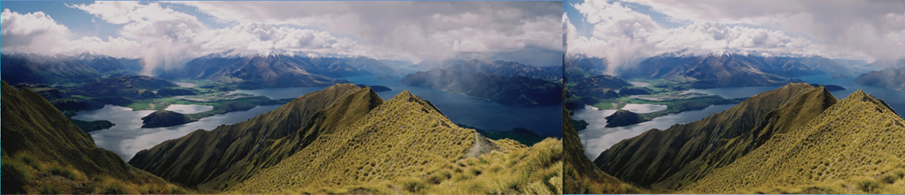
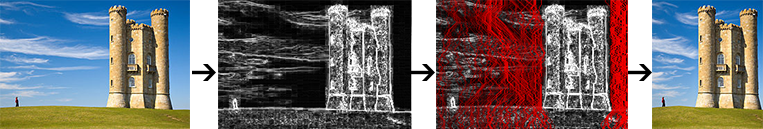
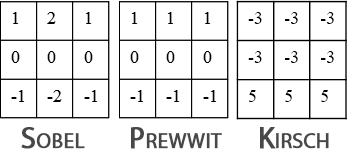
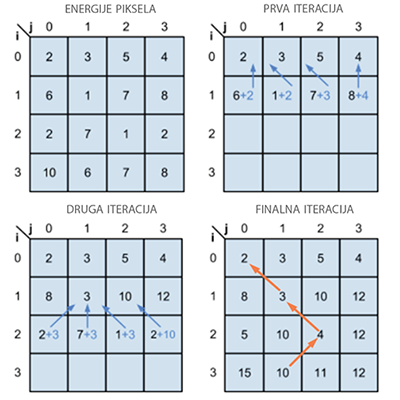
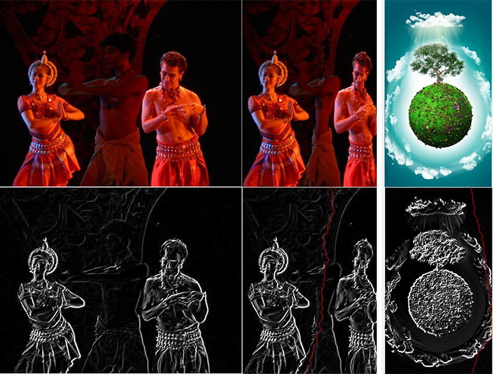

# Promena veličine slike na osnovu sadržaja

- [Cilj](#cilj)
- [Seam Carving algoritam](#seam-carving-algoritam)
- [Koraci](#koraci)
	- [Energija piskela](#energija-piskela)
		- [Konvolucioni filteri](#konvolucioni-filteri)
		- [Konvolucioni filteri za traženje ivica](#konvolucioni-filteri-za-traženje-ivica)
	- [Pronalaženje minimalnih simova](#pronalaženje-minimalnih-simova)
	- [Brisanje simova](#brisanje-simova)
- [Implementacija](#implementacija)

## Cilj

Algoritmi koji menjanju veličinu slike na osnovu njenog sadržaja su nastali kao odgovor na problem prikazivanja slika na uređijama raznih veličina (telefoni, tableti, ekrani, projektori...). Ova potreba je prisutna već neko vreme i internet stranice podržavaju dinamičke promene rasporeda elemenata na starnici i teksta ali ne i slika. Klasično skaliranje nije dovoljno jer zanemaruje sadržaj slike. Odsecanje slike (eng. *cropping*) je ograničeno jer uklanja samo piksele na ivicama slike. Veća efikasnost bi se postigla kada bi se posmatrao sadržaj slike a ne samo njena geometrija.
Promena veličine slike na osnovu sadržaja predstavlja uklanjanje (dodavanje) piksela koji nose manje značenje. Porepoznavanje objekata i bitinih elemenata slike omogućuje eleminisanje nevažnih piskela koji nisu esencijalni za sam sadržaj slike.


## Seam Carving algoritam

Seam carving (*rezbarenje šavova*) je algoritam za promenu veličine slike na osnosvu njenog sadržaja (eng. *algorithm for content-aware image resizing*) koji su razvili Shai Avidan i Ariel Shamir. Ovaj algoritam nalazi simove (eng. seams) tj. puteve koji su najmanje važni na slici i uklanja ih kako bi smanjio veličinu slike. Simovi se mogu tražiti i horizontalno i vertikalno odnosno putevi mogu ići sa vrha slike ka dnu ili sa leve strane ka desnoj. U nastavku je opisan algoritam koji uklanja piksele i simove traži vertikalno.



## Koraci

Algoritam se može opisati kroz sledeće korake gde će svaki biti objašnjen u nastavku:

1.	Izračunati energiju piksela
2.	Naći minimalne simove od vrha ka dnu slike
3.	Obrisati minimalne simove
4.	Ponovljati korake 1-3 sve dok željeni broj simova nije uklonjen



### Energija piskela

Mnoge funkcije se mogu koristiti za izračunavanje energije piksela i ne postoji optimalna odnosno određene funkcije daju bolje rezultate sa određenim slikama. U ovom slučaju su korišćeni algoritmi za detekciju ivica koji koriste konvlucione matrice za izračunavanje: Kirsch, Prewitt i Sobel. Pre primene filtera slika se prevodi u crno belu sliku.



#### Konvolucioni filteri


Konvoluciona matrica je matrica 3×3 ili 5×5 koja služi za realizaciju konvolucionih filtera. Oni se kreću kroz sliku po redovima i kolonama, redom, i izdvajaju podslike iste dimenzije kao i konvoluciona matrica. Označimo elemente podslike sa Pxy a elmente konvolucione matrice sa Cxy. Zatim se izračuna zbir svih proizvoda Pxy · Cxy i upiše se u kao vrednost centralnog piksela.

#### Konvolucioni filteri za traženje ivica

Konvolucioni filteri za traženje ivica prvo naprave kopiju slike. Zatim primene odgovarajući filter nad originalom i nad kopijom. Ako označimo rezultate P i P2, svaki piksel u rezultujućoj slici će imati vrednost: 
```
Math.Sqrt((p[i,j]*p[i,j]) + (p2[i,j] * p2[i,j]))
```

### Pronalaženje minimalnih simova

Pronalaženje simova se takođe može implemntirati korišćenjem više funkcija kao što su Dijkstrin algoritam, dinamičko programiranje, pohlepni algoritam (eng. *greedy algorithm*) i dr. U nastavku će biti objašnjen pristup koji koristi dinamičko programiranje.

Dinamičko programiranje je pojam koji se susreće u mnogim naukama kao što su informatika, matematika, ekonomija i predstavlja metod za rešavanje kompleksnog problema razbijanjem tog problema na više jednostavnijih potproblema i korišćenje njihovih rešenja u cilju traženja optimalnog rešenja celokupnog problema.

Kako bi izračunali vertikalni sim, za svaki piksel u redu računamo zbir njegove energije i najmanje energije jednog od tri piksela iznad njega. Tako će svaki piksel imati najmanju vrednost energije koja je potrebna da bi se došlo do njega. Sledeća slika opisuje postupak: 



### Brisanje simova

Samo brisanje simova je trivijalno ali je problem koliko simova obrisati.
S obzirom da je račuananje energije slike skupa operacija nameće se sledeći izbor:

1. Brisanje više simova odjednom
	1. Izračunati simove
	2. Sortirati ih od od najmanje bitnih ka najviše bitnim
	3. Obrisati prvih n sa liste	
2. Brisanje jednog sima i ponovno preračunavanje 

Prvo rešenje nije idealno i ima dosta slučajeva u kojima ne daje dobre rezultate. Takođe, prilikom brisanja više simova se može doći u situaciju da ne postoji jednak broj piksela po redu koje treba obrisati, što nameće ispitivanje disjunktnosti simova.

Drugo rešenje je sporo rešenje jer se za razliku od prvog gde se energija preračunava tek nakon brisanja n simova energija preračunava nakon brisanja svakog sima. S obzirom da nije previše sporo i da daje rezultate u razumno dugom vremenskom periodu ovo rešenje je implmentirano. Slika koja sledi prikazuje simove koji će biti obrisani: 



## Implementacija

Aplikacija kao i svaka za obradu slika omogućava učitavanje/čuvanje slike, klasičnu promenu veličine i sl. Pored toga, aplikacija omogućava korisniku tri pogleda:

1. Jednostavan pogled gde je prikazana slika koja je učitana
2. Energy pogled na kom su prikazane slike koje su nastale od osnovne, zatim konvertovane u crno belu sliku, zatim izmenjene konvolucionim filterom za detekciju ivica korišćenjem Krish, Prewitt, Sobel matrice respektivno.
3. Seam carving pogled koji je predviđen za promenu veličine slike na osnovu sadržaja korišćenjem seam carving algoritma. U gornjem desnom uglu aplikacije se nalaze opcije koje su na raspolaganju korisniku: promena matrice koja će se koristiti i broj piksela koji će se ukloniti seam carving operacijom

U nastavku su linkovi koji vode do delova koda koji implementiraju gore naveden postupak:

1. [kovenrtovanje slike u crno belu](https://github.com/MasaDjordjevic/pi-projekat/blob/master/app/SeamCarving/Filters/CoreFilters.cs#L14)
2. [konvolucioni filter](https://github.com/MasaDjordjevic/pi-projekat/blob/master/app/SeamCarving/Filters/ConvFilters.cs#L167)
3. [konvolucionoi filter za detekciju ivica](https://github.com/MasaDjordjevic/pi-projekat/blob/master/app/SeamCarving/Filters/ConvFilters.cs#L260
)
4. [pronalaženje simova koji će biti obrisani](https://github.com/MasaDjordjevic/pi-projekat/blob/master/app/SeamCarving/Views/SplitViewStrategies/SeamCravingStrategy.cs#L93)
5. [smer za brisanje simova](https://github.com/MasaDjordjevic/pi-projekat/blob/master/app/SeamCarving/Views/SplitViewStrategies/SeamCravingStrategy.cs#L166)
5. [brisanje simova](https://github.com/MasaDjordjevic/pi-projekat/blob/master/app/SeamCarving/Views/SplitViewStrategies/SeamCravingStrategy.cs#L195)

> U kodu se sve operacije koje menjaju bitmapu nalaze u `unsafe {}` bloku kako se ne bi izvršavale na CLR-u (*common language runtime*) što omogućava znatno brže izvršavanje ovih operacija.
